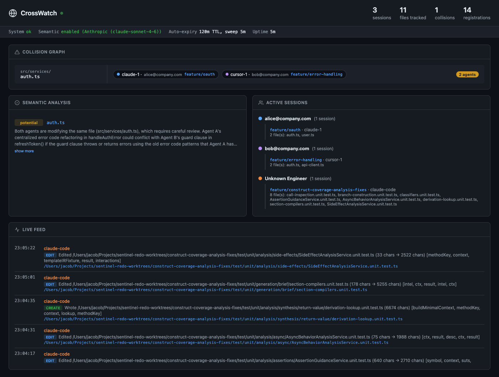

# CrossWatch

**Cross-agent collision detection for concurrent LLM coding sessions.**

When multiple AI coding agents work on the same codebase simultaneously, they have zero awareness of each other. CrossWatch is a shared bulletin board that gives agents awareness of overlapping work — and lets the agents themselves decide whether it matters.

## How it works

1. An agent is about to modify a file. It registers with CrossWatch: here's the file, here's what I'm changing, here's why.
2. CrossWatch checks if any other agents have registered on the same file.
3. If yes, the registering agent gets back a session-level collision graph — every file it has registered that has other agents, and who those agents are.
4. The agent reads the summary and decides whether to adapt its approach, proceed as planned, or flag it to the developer.

**The system has zero intelligence.** It's a registry and a notification pipe. All judgment about relevance and conflict resolution stays with the agents (the LLMs), which have full context about their own tasks.

Optional semantic analysis sends diffs to an LLM to classify changes as compatible, potentially conflicting, or conflicting — but this is the only smart part, and it's opt-in.

## Quick start

```bash
git clone <repo-url> crosswatch
cd crosswatch
npm install
npm run build
npm start
```

The server starts on `http://localhost:7429` by default. Set `CROSSWATCH_PORT` to change it.

Open the **live dashboard** at `http://localhost:7429/dashboard`:



It auto-refreshes every 3 seconds and shows:
- **System status bar** — health, semantic provider, auto-expiry config, uptime
- **Collision graph** — which files have multiple agents, who they are, what branches
- **Semantic analysis** — LLM-assessed conflict severity with explanations
- **Active sessions** — grouped by engineer, showing branch, agent, and registered files
- **Live feed** — real-time stream of all agent actions with timestamps

Run `npm run demo` in another terminal to see it in action with 5 simulated agents.

### Solo engineer (one machine, multiple agents)

This is the simplest setup — one engineer running multiple Claude Code / Cursor / Aider sessions in parallel. The server runs locally and agents connect to `localhost`:

1. **Start the server** (leave it running in a terminal or background process):
   ```bash
   cd crosswatch && npm start
   ```
2. **Install hooks** in each project/worktree where you run agents:
   ```bash
   bash /path/to/crosswatch/hooks/setup.sh
   ```
   Or add CrossWatch as an MCP server in your IDE (see [Integration](#integration)).
3. **Start your agents.** Every edit auto-registers with CrossWatch. When two agents touch the same file, both get collision warnings. No other configuration needed.

### Team (multiple engineers, shared server)

When multiple engineers on the same network each run their own agents, everyone points at a single shared CrossWatch server. The server can run on any machine reachable by the team — a shared dev box, a machine on the LAN, or a cloud VM.

1. **Pick a host** and start the server:
   ```bash
   # On the shared machine (e.g. 192.168.1.50)
   cd crosswatch && npm start
   ```
2. **On each engineer's machine**, set the server URL:
   ```bash
   export CROSSWATCH_URL=http://192.168.1.50:7429
   ```
   Add this to your shell profile (`.bashrc`, `.zshrc`) so it persists.
3. **Install hooks** in each engineer's project/worktree:
   ```bash
   bash /path/to/crosswatch/hooks/setup.sh
   ```
4. **Start your agents.** Engineer identity is auto-detected from `git config user.email` — no additional config needed. Collision warnings will distinguish between your own parallel sessions and other engineers' agents.

## Semantic analysis (optional)

CrossWatch can use an LLM to analyze whether concurrent changes are semantically compatible. This is the only part of CrossWatch that calls an external API.

**You provide your own API key. Standard API usage fees from your provider apply.** Each analysis sends a short summary of recent actions (not full file contents) to the LLM, so token usage per call is small. Analyses are triggered automatically when agents record actions on files with collisions, and results are cached to avoid redundant calls.

If no API key is set, semantic analysis is disabled and CrossWatch operates as a pure registry — registration, awareness, feeds, SSE, and the dashboard all work without any API key.

### Configuration

Create a `.env` file in the CrossWatch directory:

```bash
# .env — pick one provider

# Option A: Anthropic (default model: claude-sonnet-4-6)
ANTHROPIC_API_KEY=sk-ant-...

# Option B: OpenAI (default model: gpt-4o)
OPENAI_API_KEY=sk-...

# Option C: Google Gemini (default model: gemini-2.0-flash)
GOOGLE_API_KEY=...

# Optional: override the default model for your chosen provider
CROSSWATCH_MODEL=claude-haiku-4-5-20251001

# Optional: change the server port (default: 7429)
CROSSWATCH_PORT=7429
```

Or pass as environment variables directly:

```bash
ANTHROPIC_API_KEY=sk-ant-... npm start
OPENAI_API_KEY=sk-... CROSSWATCH_MODEL=gpt-4o-mini npm start
GOOGLE_API_KEY=... npm start
```

| Provider  | Env var             | Default model        |
|-----------|---------------------|----------------------|
| Anthropic | `ANTHROPIC_API_KEY` | `claude-sonnet-4-6`  |
| OpenAI    | `OPENAI_API_KEY`    | `gpt-4o`             |
| Google    | `GOOGLE_API_KEY`    | `gemini-2.0-flash`   |

Priority order: Anthropic > OpenAI > Google. Override the model with `CROSSWATCH_MODEL`. See `.env.example` for all available configuration options.

If no API key is set, semantic analysis is disabled and CrossWatch operates as a pure registry — registration, awareness, feeds, SSE, and the dashboard all work without any API key or external calls.

## Multi-engineer support

CrossWatch tracks which engineer owns each agent session, so collision warnings distinguish between "your own parallel agents" and "another engineer's agents."

### How it works

Each registration includes an `engineerId` field. The Claude Code hooks auto-detect this from `git config user.email` — zero configuration needed. For the MCP server or direct HTTP usage, set `CROSSWATCH_ENGINEER_ID` in the environment.

When collisions are reported, they're grouped:
- **OTHER ENGINEERS**: Collisions with agents owned by a different person — these usually require coordination
- **YOUR OTHER SESSIONS**: Collisions with your own parallel agents — you may be able to resolve these yourself

### Setup for a team

For multi-engineer support, everyone's agents must point at the **same CrossWatch server**:

```bash
# Engineer A's machine
export CROSSWATCH_URL=http://192.168.1.50:7429

# Engineer B's machine
export CROSSWATCH_URL=http://192.168.1.50:7429
```

The server can run on any machine on the LAN, a shared dev box, or a cloud VM. Engineer identity flows automatically from `git config user.email`.

| Env var                    | Description                                          | Default                      |
|----------------------------|------------------------------------------------------|------------------------------|
| `CROSSWATCH_ENGINEER_ID`   | Override engineer identity                           | `git config user.email`      |
| `CROSSWATCH_URL`           | Server URL (set on each engineer's machine)          | `http://localhost:7429`      |

## Auto-expiry

Sessions that go idle are automatically purged, preventing memory leaks from crashed or abandoned agent sessions.

| Env var                      | Description                                | Default                    |
|------------------------------|---------------------------------------------|---------------------------|
| `CROSSWATCH_SESSION_TTL`     | Session TTL in ms. Set to `0` to disable.   | `7200000` (2 hours)       |
| `CROSSWATCH_SWEEP_INTERVAL`  | How often to check for expired sessions     | `300000` (5 minutes)      |

Any registration or action recording resets the session's expiry clock. The MCP server also sends a heartbeat every 60 seconds to keep long-running sessions alive.

Set `CROSSWATCH_SESSION_TTL=0` to disable auto-expiry entirely.

## Worktree scripts

CrossWatch ships utility scripts for managing git worktrees with hooks pre-installed. These automate the most common workflow — spinning up parallel feature branches, each with collision detection ready to go.

**Typical workflow:**

1. **`new-feature.sh`** — Create a new worktree with hooks installed
2. Work on your feature (collision detection is automatic)
3. Commit your work on the feature branch
4. **`morning-sync.sh`** — Sync all worktrees with main. **All worktree branches must have open work committed first** — the script rebases each branch onto `origin/main` and uncommitted changes will be lost
5. Merge your feature branch into main (PR or `git merge feature/my-feature`)
6. **`remove-feature.sh`** — Remove the worktree. **Merge your branch first** — this deletes the worktree directory and optionally the branch

### `scripts/new-feature.sh`

Creates a new git worktree, installs CrossWatch hooks, runs `npm install`, and rebases onto main:

```bash
# From your project root:
bash /path/to/crosswatch/scripts/new-feature.sh oauth-scopes
# Creates: ../<repo-name>-oauth-scopes on branch feature/oauth-scopes
```

Set `CROSSWATCH_HOME` to tell the script where CrossWatch is installed (defaults to `~/tools/crosswatch`).

### `scripts/morning-sync.sh`

Syncs all worktrees with main, updates CrossWatch hooks in each, checks if the server is running, and shows collision status. Run this before starting work each day:

```bash
# Commit open work on ALL worktree branches first!
bash /path/to/crosswatch/scripts/morning-sync.sh
```

**Warning:** This rebases every worktree branch onto `origin/main`. Uncommitted changes will be lost. Commit or stash open work on all branches before running.

### `scripts/remove-feature.sh`

Removes a worktree and optionally deletes its branch:

```bash
# Merge your feature branch into main BEFORE removing!
bash /path/to/crosswatch/scripts/remove-feature.sh oauth-scopes
```

**Warning:** This deletes the worktree directory and optionally the branch. Merge your work first or it will be lost.

### VS Code / Cursor tasks

All scripts are also available as VS Code tasks (works in Cursor too). Open the command palette (`Cmd+Shift+P`) and run "Tasks: Run Task":

- **CrossWatch: New Feature Worktree** — prompts for a feature name, creates the worktree
- **CrossWatch: Morning Sync** — syncs all worktrees with main
- **CrossWatch: Remove Feature Worktree** — prompts for feature name, removes the worktree
- **CrossWatch: Start Server** — starts the CrossWatch server
- **CrossWatch: Build** — compiles TypeScript

## API

### `POST /register`
Register intent to modify files and get session-level awareness in one atomic call. Supports single file or batch.

**Single file:**
```json
{
  "engineerId": "alice@example.com",
  "agentId": "claude-code-1",
  "sessionId": "session-feature-xx",
  "branch": "feature-xx",
  "file": "src/services/auth.ts",
  "symbols": ["refreshToken", "TokenResponse"],
  "intent": "Adding OAuth scope validation to token refresh flow",
  "impact": "refreshToken() gains required OAuthScope parameter"
}
```

**Batch (multiple files):**
```json
{
  "engineerId": "alice@example.com",
  "agentId": "claude-code-1",
  "sessionId": "session-feature-xx",
  "branch": "feature-xx",
  "files": [
    {
      "file": "src/services/auth.ts",
      "symbols": ["refreshToken"],
      "intent": "Adding OAuth scope validation",
      "impact": "refreshToken() gains required param"
    },
    {
      "file": "src/models/user.ts",
      "symbols": ["User"],
      "intent": "Adding scopes field to User model",
      "impact": "User type gets new required field"
    }
  ]
}
```

**Response** (session-level awareness):
```json
{
  "registrations": [{ "id": "...", "file": "...", "..." : "..." }],
  "awareness": {
    "sessionFiles": 2,
    "collisions": [{
      "file": "src/services/auth.ts",
      "totalAgentsOnFile": 2,
      "overlapping": [{
        "agentId": "cursor-agent",
        "sessionId": "session-feature-xy",
        "branch": "feature-xy",
        "symbols": ["refreshToken", "handleAuthError"],
        "intent": "Refactoring error handling in refreshToken()",
        "impact": "Internal error handling structure will change",
        "sessionIntent": "Improve error handling across auth module"
      }]
    }],
    "uniqueOverlappingSessions": 1,
    "overlappingSessions": [{
      "sessionId": "session-feature-xy",
      "agentId": "cursor-agent",
      "branch": "feature-xy",
      "sharedFiles": ["src/services/auth.ts"],
      "totalFiles": 2
    }]
  }
}
```

### `GET /awareness/:sessionId`
Get the full collision graph for a session across all its registered files.

### `GET /check?file=path&session=optional`
Check a single file for other agents without registering.

### `POST /action`
Record an action to the live feed (call after modifying a file).

```json
{
  "sessionId": "session-xx",
  "agentId": "claude-code",
  "file": "src/services/auth.ts",
  "type": "edit",
  "summary": "Added OAuthScope enum and guard clause",
  "symbols": ["refreshToken", "OAuthScope"],
  "detail": "optional diff or code snippet"
}
```

### `GET /feed/session/:sessionId`
Pull all actions from other agents across all collision files for a session. Supports cursor-based pagination with `?after=seq`.

### `GET /feed/session/:sessionId/summary`
Same as above but returns pre-formatted text suitable for LLM context injection.

### `GET /feed/file?file=path`
Per-file action feed. Optional query params: `session` (exclude), `after` (cursor), `limit`.

### `GET /feed/file/summary?file=path`
Same as above but returns pre-formatted text. Optional: `session`, `after`.

### `POST /session/:sessionId/intent`
Set a high-level intent for a session. Body: `{ "intent": "..." }`.

### `GET /session/:sessionId/intent`
Get the stored intent for a session.

### `GET /stream/session/:sessionId`
SSE stream of real-time actions across all collision files.

### `GET /stream/file?file=path&session=id`
SSE stream for a single file.

### `GET /semantic/:sessionId`
Get cached semantic analysis results for a session.

### `POST /session/:sessionId/heartbeat`
Keep a session alive without registering or recording an action. Resets the auto-expiry clock.

### `DELETE /session/:sessionId`
End a session — removes all registrations, actions, and semantic cache.

### `GET /status`
Full registry status: all registrations, collision graph.

### `GET /health`
Health check. Returns system status, semantic provider info, auto-expiry config, uptime, and port.

## Integration

CrossWatch is agent-agnostic. Any coding agent that can make HTTP calls can use it. There are three integration approaches, from lightest to richest:

### 1. Direct HTTP (any agent)

Any agent can register and poll via the REST API. This works with any LLM-based coding tool.

```bash
# Register before editing
curl -X POST http://localhost:7429/register \
  -H 'Content-Type: application/json' \
  -d '{"agentId":"my-agent","sessionId":"sess-1","branch":"feature/x","file":"src/foo.ts","intent":"adding validation","symbols":["validate"]}'

# Record action after editing
curl -X POST http://localhost:7429/action \
  -H 'Content-Type: application/json' \
  -d '{"sessionId":"sess-1","agentId":"my-agent","file":"src/foo.ts","type":"edit","summary":"Added input validation to validate()"}'

# Pull feed
curl http://localhost:7429/feed/session/sess-1/summary

# Clean up when done
curl -X DELETE http://localhost:7429/session/sess-1
```

### 2. Claude Code hooks (automatic, zero-tool-call)

Claude Code supports pre/post tool-use hooks. CrossWatch ships with hooks that automatically register files before edits and surface collision warnings after edits — no MCP tools needed, no agent prompting required.

**Install:**
```bash
# From your project root:
bash /path/to/crosswatch/hooks/setup.sh

# Or use the worktree script to create a new feature branch with hooks pre-installed:
bash /path/to/crosswatch/scripts/new-feature.sh my-feature
```

**What the hooks do:**
- `pre-edit.js` (PreToolUse on Edit/Write/MultiEdit): Registers the file + intent with CrossWatch before every edit. Extracts the session's first user message as a high-level task description. Blocks edits if a semantic conflict has been detected.
- `post-edit.js` (PostToolUse on Edit/Write/MultiEdit): Records the completed action with diff context. Surfaces collision warnings and semantic analysis results to the agent via stderr. Only injects into agent context when there's a potential or actual conflict.

**Manual hook config** (if not using setup.sh):

Add to your project's `.claude/settings.json`:
```json
{
  "hooks": {
    "PreToolUse": [
      {
        "matcher": "Edit|Write|MultiEdit",
        "hooks": [{
          "type": "command",
          "command": "node \"/path/to/crosswatch/hooks/pre-edit.js\"",
          "timeout": 5
        }]
      }
    ],
    "PostToolUse": [
      {
        "matcher": "Edit|Write|MultiEdit",
        "hooks": [{
          "type": "command",
          "command": "node \"/path/to/crosswatch/hooks/post-edit.js\"",
          "timeout": 3
        }]
      }
    ]
  }
}
```

The hooks read `CROSSWATCH_URL` from the environment (defaults to `http://localhost:7429`).

### 3. Claude Code MCP server (tool-based)

If you prefer the agent to explicitly call CrossWatch tools (register, pull, done), use the MCP server:

```bash
claude mcp add crosswatch -- node /path/to/crosswatch/dist/mcp-server.js
```

Or add to `.claude/settings.json`:
```json
{
  "mcpServers": {
    "crosswatch": {
      "command": "node",
      "args": ["/path/to/crosswatch/dist/mcp-server.js"],
      "env": {
        "CROSSWATCH_URL": "http://localhost:7429",
        "CROSSWATCH_AGENT_ID": "claude-code",
        "CROSSWATCH_BRANCH": "main"
      }
    }
  }
}
```

**MCP tools:**
- `crosswatch_register` — Register intent on one or more files, get awareness
- `crosswatch_action` — Record a completed action
- `crosswatch_pull` — Pull the live feed from other agents
- `crosswatch_awareness` — Get the full collision graph
- `crosswatch_done` — End session and clean up

### 4. Cursor / Windsurf (MCP)

Cursor and Windsurf both support MCP servers. Add CrossWatch as an MCP server to give the agent collision awareness tools.

**Cursor:** Add to `.cursor/mcp.json` in your project:
```json
{
  "mcpServers": {
    "crosswatch": {
      "command": "node",
      "args": ["/path/to/crosswatch/dist/mcp-server.js"],
      "env": {
        "CROSSWATCH_URL": "http://localhost:7429",
        "CROSSWATCH_AGENT_ID": "cursor",
        "CROSSWATCH_BRANCH": "main"
      }
    }
  }
}
```

**Windsurf:** Add to `~/.codeium/windsurf/mcp_config.json`:
```json
{
  "mcpServers": {
    "crosswatch": {
      "command": "node",
      "args": ["/path/to/crosswatch/dist/mcp-server.js"],
      "env": {
        "CROSSWATCH_URL": "http://localhost:7429",
        "CROSSWATCH_AGENT_ID": "windsurf",
        "CROSSWATCH_BRANCH": "main"
      }
    }
  }
}
```

The MCP tools (`crosswatch_register`, `crosswatch_action`, etc.) will appear in the agent's tool list. Add a note to the project's AI rules or system prompt telling the agent to call `crosswatch_register` before edits and `crosswatch_action` after — the tools are self-descriptive, but the agent needs to know it should use them proactively.

### 5. OpenAI / ChatGPT-based agents

OpenAI doesn't have pre/post edit hooks. Instead, wrap your file-editing logic with CrossWatch calls in your agent loop. Here's a complete pattern:

**Define the tools:**
```python
crosswatch_tools = [
    {
        "type": "function",
        "function": {
            "name": "crosswatch_register",
            "description": "Register intent to modify a file. Call BEFORE editing. Returns awareness of other agents on the same files.",
            "parameters": {
                "type": "object",
                "properties": {
                    "file": {"type": "string", "description": "File path to register"},
                    "intent": {"type": "string", "description": "What you plan to do and why"},
                    "symbols": {"type": "array", "items": {"type": "string"}, "description": "Functions/types being modified"}
                },
                "required": ["file", "intent"]
            }
        }
    },
    {
        "type": "function",
        "function": {
            "name": "crosswatch_action",
            "description": "Record a completed edit. Call AFTER modifying a file so other agents can see what you did.",
            "parameters": {
                "type": "object",
                "properties": {
                    "file": {"type": "string"},
                    "type": {"type": "string", "enum": ["edit", "create", "delete", "rename", "test", "command", "decision", "note"]},
                    "summary": {"type": "string", "description": "What you did, one sentence"},
                    "symbols": {"type": "array", "items": {"type": "string"}}
                },
                "required": ["file", "type", "summary"]
            }
        }
    },
    {
        "type": "function",
        "function": {
            "name": "crosswatch_pull",
            "description": "Pull the live feed of actions from other agents on your collision files.",
            "parameters": {"type": "object", "properties": {}}
        }
    }
]
```

**Handle tool calls in your agent loop:**
```python
import requests
import uuid

CROSSWATCH_URL = "http://localhost:7429"
SESSION_ID = f"openai-{uuid.uuid4().hex[:8]}"
AGENT_ID = "openai-agent"
BRANCH = "feature/my-feature"

def handle_crosswatch_call(name, args):
    if name == "crosswatch_register":
        resp = requests.post(f"{CROSSWATCH_URL}/register", json={
            "agentId": AGENT_ID,
            "sessionId": SESSION_ID,
            "branch": BRANCH,
            "file": args["file"],
            "intent": args["intent"],
            "symbols": args.get("symbols", []),
        })
        awareness = resp.json()["awareness"]
        if awareness["collisions"]:
            return f"COLLISION: {len(awareness['collisions'])} file(s) have other agents. " + \
                   "\n".join(f"  {c['file']}: {c['overlapping'][0]['intent']}" for c in awareness["collisions"])
        return "No collisions. Proceed."

    elif name == "crosswatch_action":
        requests.post(f"{CROSSWATCH_URL}/action", json={
            "sessionId": SESSION_ID,
            "agentId": AGENT_ID,
            "file": args["file"],
            "type": args["type"],
            "summary": args["summary"],
            "symbols": args.get("symbols", []),
        })
        return "Action recorded."

    elif name == "crosswatch_pull":
        resp = requests.get(f"{CROSSWATCH_URL}/feed/session/{SESSION_ID}/summary")
        return resp.text
```

**Alternatively, wrap edits automatically** (no tool calls needed — the agent doesn't even know about CrossWatch):
```python
def edit_file_with_crosswatch(file_path, new_content, intent, symbols=None):
    """Drop-in replacement for file writes that adds CrossWatch awareness."""
    # Pre-edit: register
    reg = requests.post(f"{CROSSWATCH_URL}/register", json={
        "agentId": AGENT_ID, "sessionId": SESSION_ID, "branch": BRANCH,
        "file": file_path, "intent": intent, "symbols": symbols or [],
    }).json()

    # Check for conflicts
    collisions = reg["awareness"]["collisions"]
    warning = None
    if collisions:
        warning = f"WARNING: {len(collisions)} collision(s) detected on {file_path}"

    # Do the edit
    with open(file_path, "w") as f:
        f.write(new_content)

    # Post-edit: record action
    requests.post(f"{CROSSWATCH_URL}/action", json={
        "sessionId": SESSION_ID, "agentId": AGENT_ID,
        "file": file_path, "type": "edit",
        "summary": intent, "symbols": symbols or [],
    })

    return warning  # Inject into agent context if not None
```

### 6. Google Gemini / Vertex AI agents

Same pattern as OpenAI. Define tools and handle them in your agent loop:

**Define function declarations:**
```python
from google.genai import types

crosswatch_tools = [
    types.FunctionDeclaration(
        name="crosswatch_register",
        description="Register intent to modify a file. Call BEFORE editing. Returns awareness of other agents.",
        parameters=types.Schema(
            type=types.Type.OBJECT,
            properties={
                "file": types.Schema(type=types.Type.STRING, description="File path"),
                "intent": types.Schema(type=types.Type.STRING, description="What and why"),
                "symbols": types.Schema(type=types.Type.ARRAY, items=types.Schema(type=types.Type.STRING)),
            },
            required=["file", "intent"],
        ),
    ),
    types.FunctionDeclaration(
        name="crosswatch_action",
        description="Record a completed edit. Call AFTER modifying a file.",
        parameters=types.Schema(
            type=types.Type.OBJECT,
            properties={
                "file": types.Schema(type=types.Type.STRING),
                "type": types.Schema(type=types.Type.STRING, enum=["edit", "create", "delete", "rename", "test", "command", "decision", "note"]),
                "summary": types.Schema(type=types.Type.STRING, description="What you did"),
                "symbols": types.Schema(type=types.Type.ARRAY, items=types.Schema(type=types.Type.STRING)),
            },
            required=["file", "type", "summary"],
        ),
    ),
    types.FunctionDeclaration(
        name="crosswatch_pull",
        description="Pull the live feed of actions from other agents.",
        parameters=types.Schema(type=types.Type.OBJECT, properties={}),
    ),
]
```

**Handle function calls:**
```python
import requests
import uuid

CROSSWATCH_URL = "http://localhost:7429"
SESSION_ID = f"gemini-{uuid.uuid4().hex[:8]}"

def handle_crosswatch(fn_name, fn_args):
    if fn_name == "crosswatch_register":
        resp = requests.post(f"{CROSSWATCH_URL}/register", json={
            "agentId": "gemini-agent",
            "sessionId": SESSION_ID,
            "branch": "feature/my-feature",
            "file": fn_args["file"],
            "intent": fn_args["intent"],
            "symbols": fn_args.get("symbols", []),
        })
        awareness = resp.json()["awareness"]
        if awareness["collisions"]:
            return {"collisions": awareness["collisions"]}
        return {"status": "no collisions"}

    elif fn_name == "crosswatch_action":
        requests.post(f"{CROSSWATCH_URL}/action", json={
            "sessionId": SESSION_ID,
            "agentId": "gemini-agent",
            **fn_args,
        })
        return {"status": "recorded"}

    elif fn_name == "crosswatch_pull":
        return {"feed": requests.get(f"{CROSSWATCH_URL}/feed/session/{SESSION_ID}/summary").text}
```

Google's Gemini API and Vertex AI don't have pre/post edit hooks. Use either the tool-based approach above (where the agent calls CrossWatch explicitly) or the wrapper approach shown in the OpenAI section (where your orchestration code calls CrossWatch transparently around every file write).

### Integration summary

| Platform         | Hook-based (automatic) | Tool-based (explicit) | HTTP (manual) |
|------------------|------------------------|-----------------------|---------------|
| Claude Code      | Pre/PostToolUse hooks  | MCP server            | curl/fetch    |
| OpenAI agents    | —                      | Function calling      | curl/fetch    |
| Google Gemini    | —                      | Function declarations | curl/fetch    |
| Cursor           | —                      | MCP server            | curl/fetch    |
| Windsurf         | —                      | MCP server            | curl/fetch    |
| Aider            | —                      | —                     | curl/fetch    |
| Any HTTP client  | —                      | —                     | curl/fetch    |

## Design principles

- **Awareness, not filtering.** Every file overlap is surfaced. The agent decides if it matters.
- **Ephemeral, not memory.** Data exists only during concurrent work sessions. Once branches merge, the registry is irrelevant.
- **Provider-agnostic.** Works with Claude, OpenAI, Gemini, Cursor, Copilot, Aider, or any agent that can make HTTP calls. Semantic analysis supports Anthropic, OpenAI, and Google models.
- **Zero intelligence in the system.** The coordination layer is a dumb bulletin board. LLMs in each agent do all the reasoning.
- **One call does everything.** Register and discover in a single atomic operation.

## Running in the background

CrossWatch is a long-running server. A few options for keeping it running:

```bash
# Simple background process
nohup npm start > crosswatch.log 2>&1 &

# With a process manager (pm2)
npx pm2 start dist/index.js --name crosswatch

# macOS launchd — create ~/Library/LaunchAgents/com.crosswatch.plist
# Linux systemd — create /etc/systemd/system/crosswatch.service
```

The server is stateless (in-memory only). Restarting it clears all sessions — agents will re-register on their next edit.

## Architecture

```
┌─────────────┐     ┌─────────────┐     ┌─────────────┐
│  Agent 1    │     │  Agent 2    │     │  Agent 3    │
│  (Claude)   │     │  (OpenAI)   │     │  (Gemini)   │
└──────┬──────┘     └──────┬──────┘     └──────┬──────┘
       │                   │                   │
       │  POST /register   │  POST /register   │
       ▼                   ▼                   ▼
┌──────────────────────────────────────────────────────┐
│                    CrossWatch                         │
│                                                       │
│   Registry (in-memory)                                │
│   ┌───────────────────────────────────┐              │
│   │ file → [agent, symbols, intent]   │              │
│   └───────────────────────────────────┘              │
│                                                       │
│   Action Feed (streaming + polling)                   │
│   Semantic Analyzer (Anthropic / OpenAI / Google)     │
│                                                       │
│   On register: check file index → return awareness    │
└──────────────────────────────────────────────────────┘
```

## License

MIT
